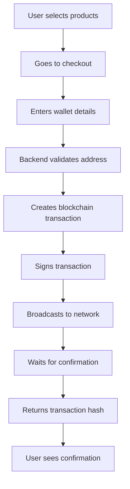

# 🔗 Blockchain Payment Setup Guide

## Overview
This guide explains how to set up real blockchain payments for your Ethiopian coffee marketplace using Ethereum and Hedera networks.

## 🚀 Quick Start

### 1. Install Required Dependencies

```bash
cd backend
npm install ethers @hashgraph/sdk
```

### 2. Environment Variables

Create a `.env` file in the backend directory:

```env
# Ethereum Configuration
ETHEREUM_RPC_URL=https://sepolia.infura.io/v3/YOUR_INFURA_KEY
# or use Alchemy: https://eth-sepolia.g.alchemy.com/v2/YOUR_ALCHEMY_KEY

# Hedera Configuration
HEDERA_ACCOUNT_ID=0.0.123456
HEDERA_PRIVATE_KEY=302e020100300506032b657004220420...

# Server Configuration
PORT=4000
```

### 3. Get API Keys

#### For Ethereum:
1. **Infura**: Go to [infura.io](https://infura.io) and create a project
2. **Alchemy**: Go to [alchemy.com](https://alchemy.com) and create an app
3. **QuickNode**: Alternative RPC provider

#### For Hedera:
1. **Hedera Portal**: Go to [portal.hedera.com](https://portal.hedera.com)
2. Create a testnet account
3. Get your Account ID and Private Key

## 🔧 How Blockchain Payments Work

### Ethereum Payments

```javascript
// 1. User enters wallet address and private key
// 2. Backend validates the address format
// 3. Creates a transaction object
const transaction = {
    to: recipientAddress,
    value: ethers.parseEther(amount),
    gasLimit: 21000,
    gasPrice: await provider.getGasPrice()
};

// 4. Signs and sends the transaction
const wallet = new ethers.Wallet(privateKey, provider);
const tx = await wallet.sendTransaction(transaction);

// 5. Waits for confirmation
const receipt = await tx.wait();
```

### Hedera Payments

```javascript
// 1. User enters Hedera account ID
// 2. Backend creates a transfer transaction
const transferTransaction = new TransferTransaction()
    .addHbarTransfer(senderAccountId, new Hbar(-amount))
    .addHbarTransfer(recipientAccountId, new Hbar(amount));

// 3. Executes the transaction
const response = await transferTransaction.execute(client);
const receipt = await response.getReceipt(client);
```

## 🛡️ Security Considerations

### ⚠️ Important Security Notes

1. **Never store private keys in production**
2. **Use environment variables for sensitive data**
3. **Implement proper wallet connection (MetaMask, etc.)**
4. **Validate all inputs before processing**
5. **Use testnet for development**

### Production Security

```javascript
// Use MetaMask or similar for production
const connectWallet = async () => {
    if (window.ethereum) {
        const accounts = await window.ethereum.request({
            method: 'eth_requestAccounts'
        });
        return accounts[0];
    }
    throw new Error('MetaMask not found');
};
```

## 📊 Transaction Flow



## 🔍 Testing Your Setup

### 1. Test Ethereum Connection

```bash
curl -X POST http://localhost:4000/api/process-payment \
  -H "Content-Type: application/json" \
  -d '{
    "walletAddress": "0x742d35Cc6634C0532925a3b8D0C0C1C0C0C0C0C0",
    "privateKey": "0x...",
    "amount": 0.1,
    "network": "ethereum"
  }'
```

### 2. Test Hedera Connection

```bash
curl -X POST http://localhost:4000/api/process-payment \
  -H "Content-Type: application/json" \
  -d '{
    "walletAddress": "0.0.123456",
    "amount": 10,
    "network": "hedera"
  }'
```

### 3. Check Transaction Status

```bash
curl http://localhost:4000/api/transaction/0x123...?network=ethereum
```

## 💰 Cost Considerations

### Ethereum (Sepolia Testnet)
- **Gas fees**: ~0.001 ETH per transaction
- **Test ETH**: Get from [Sepolia Faucet](https://sepoliafaucet.com/)

### Hedera (Testnet)
- **Transaction fees**: ~$0.0001 USD
- **Test HBAR**: Get from [Hedera Portal](https://portal.hedera.com/)

## 🚀 Production Deployment

### 1. Use Mainnet Networks
- **Ethereum Mainnet**: Real ETH transactions
- **Hedera Mainnet**: Real HBAR transactions

### 2. Implement Wallet Integration
- **MetaMask**: For Ethereum
- **HashPack**: For Hedera
- **WalletConnect**: Universal wallet connection

### 3. Add Error Handling
```javascript
try {
    const result = await processPayment(data);
    // Handle success
} catch (error) {
    if (error.code === 'INSUFFICIENT_FUNDS') {
        // Handle insufficient funds
    } else if (error.code === 'NETWORK_ERROR') {
        // Handle network issues
    }
}
```

## 📱 Frontend Integration

### MetaMask Integration Example

```javascript
// Connect to MetaMask
const connectMetaMask = async () => {
    if (window.ethereum) {
        const accounts = await window.ethereum.request({
            method: 'eth_requestAccounts'
        });
        return accounts[0];
    }
};

// Get account balance
const getBalance = async (address) => {
    const balance = await window.ethereum.request({
        method: 'eth_getBalance',
        params: [address, 'latest']
    });
    return ethers.formatEther(balance);
};
```

## 🔧 Troubleshooting

### Common Issues

1. **"Invalid wallet address"**
   - Check address format (0x... for Ethereum, 0.0.123456 for Hedera)

2. **"Insufficient funds"**
   - Ensure wallet has enough ETH/HBAR for transaction + gas fees

3. **"Network error"**
   - Check RPC URL configuration
   - Verify network connectivity

4. **"Transaction failed"**
   - Check gas limits
   - Verify transaction parameters

### Debug Mode

```javascript
// Enable debug logging
const debugMode = process.env.NODE_ENV === 'development';

if (debugMode) {
    console.log('Transaction details:', {
        to: walletAddress,
        amount: amount,
        gasPrice: gasPrice,
        gasLimit: gasLimit
    });
}
```

## 📚 Additional Resources

- [Ethereum Documentation](https://ethereum.org/developers/)
- [Hedera Documentation](https://docs.hedera.com/)
- [Ethers.js Documentation](https://docs.ethers.io/)
- [Hedera SDK Documentation](https://docs.hedera.com/hedera-sdk-java/)

## 🎯 Next Steps

1. **Set up your environment variables**
2. **Test with small amounts on testnet**
3. **Implement proper wallet integration**
4. **Add transaction history tracking**
5. **Deploy to production with mainnet**

---

**⚠️ Remember**: Always test on testnet before using mainnet with real funds!
